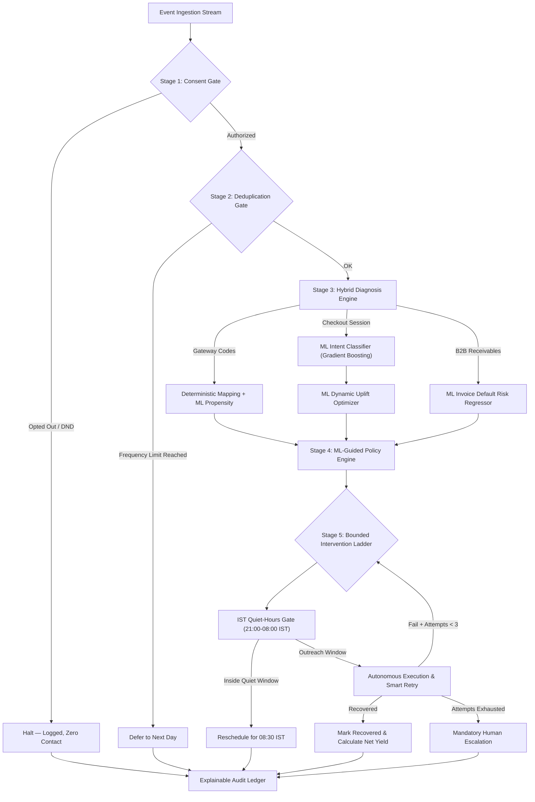

# Revenue Recovery Agent (Enterprise ML Edition)

> **Autonomous Multi-Channel Revenue Recovery Engine powered by Machine Learning, Dynamic Uplift Optimization, and Explainable AI.**

---

## 1. Problem & Architecture

Revenue leaks through four distinct doors — **payment failures**, **abandoned checkouts**, **failed subscription renewals**, and **B2B overdue receivables**. While the symptom looks different in each channel, the underlying objective is identical: **recovering at-risk money while strictly optimizing Net Value and adhering to compliance guardrails**.

